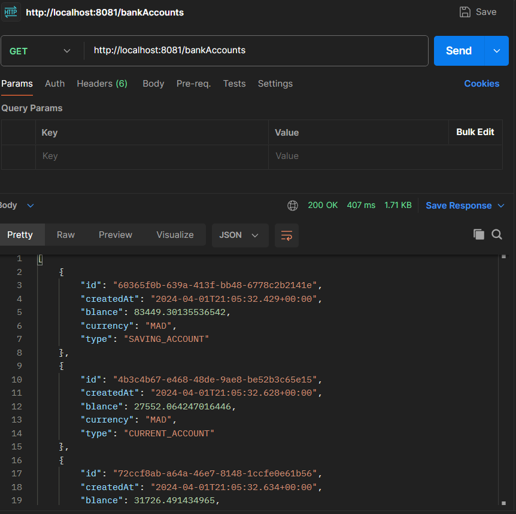
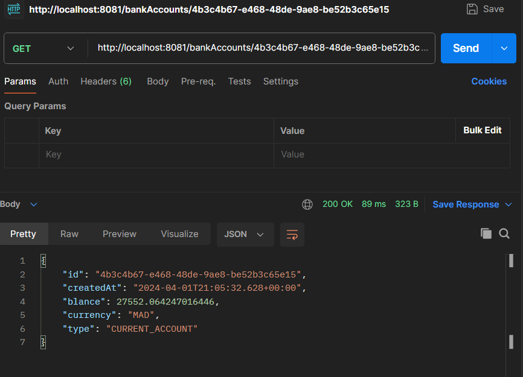
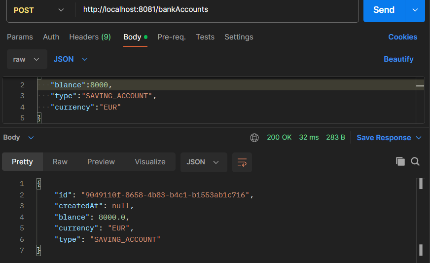
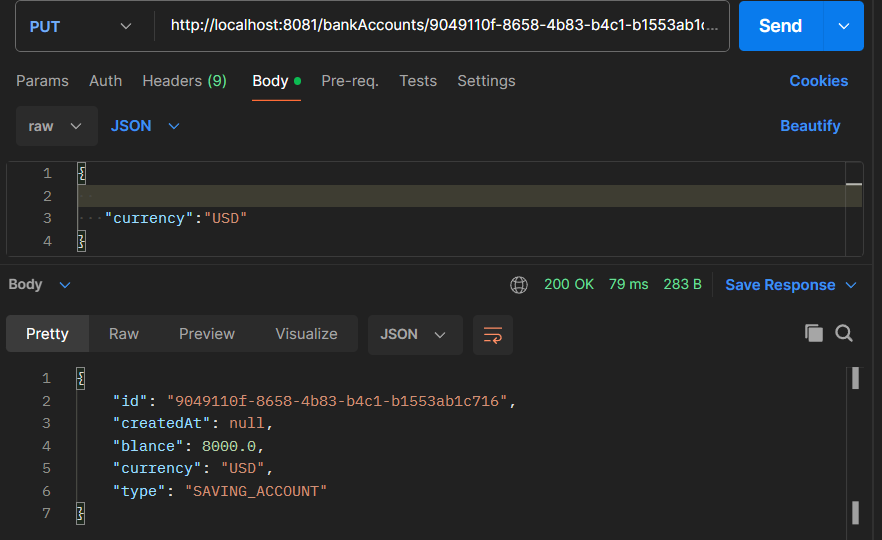
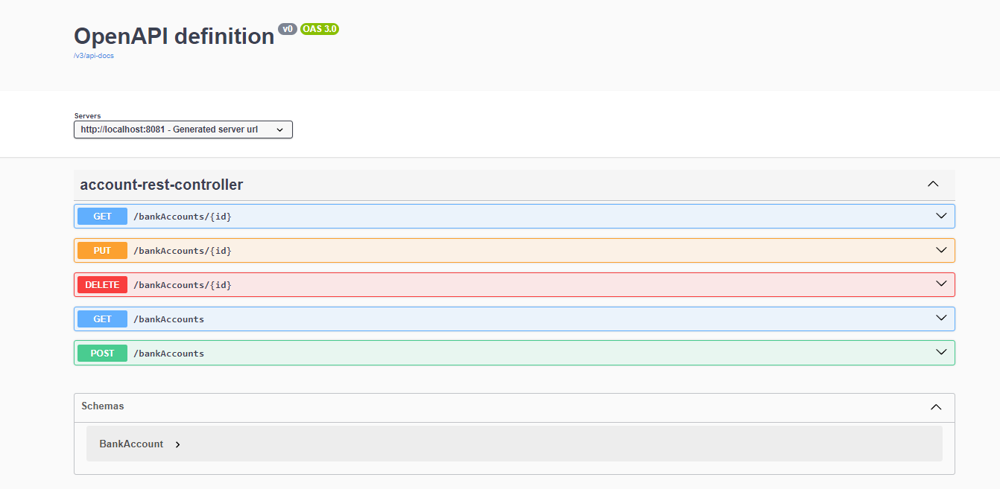
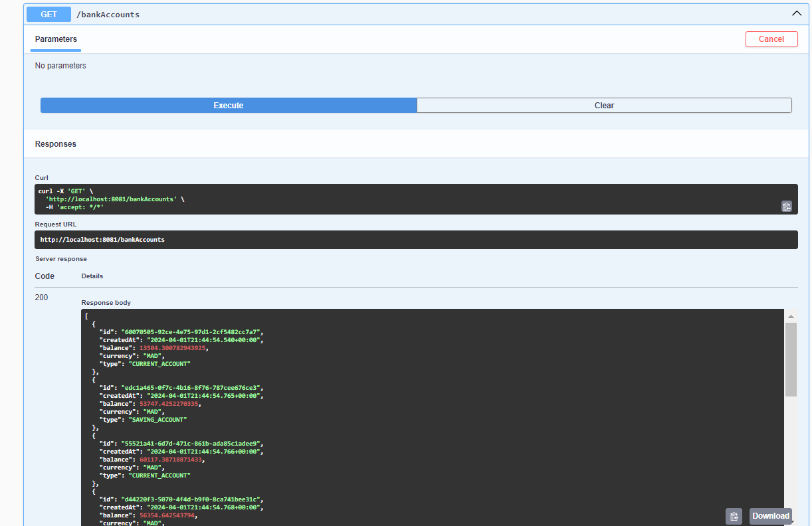
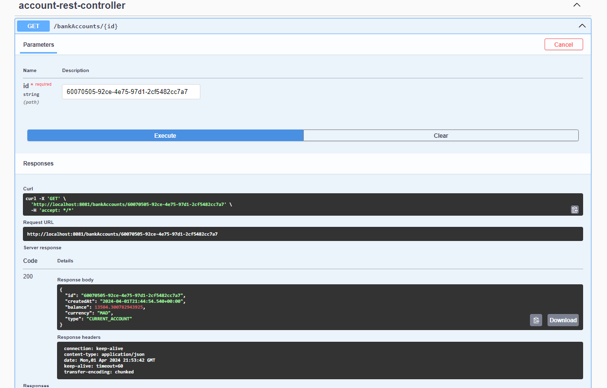
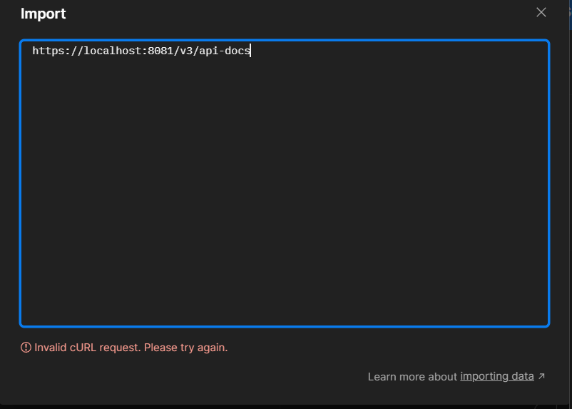

<h3>les captures du TP compte bancaire <h3>

 l'image de la connection à la base de donnée

 l'image de l'affichage des comptes

 l'image de l'affichage des comptes sous format json

 les images des operations get, post, put avec postman

 Captures des testes avec springdoc-openapi

 l'image de l'erreur que j'ai eu au moment de limportation du lien 
de la documentation de springdoc-openapi sur swagger-ui

